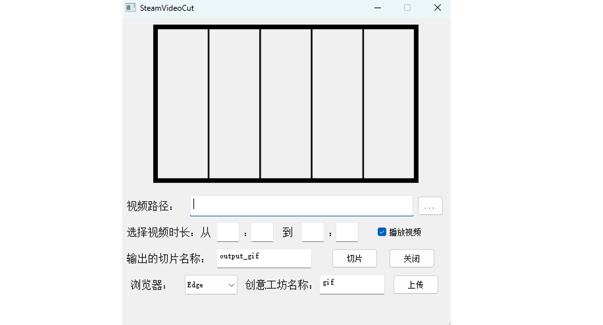

# VideoClip
This repository provides an easy tool to split a specified video into 5 GIF animations and automatically upload them to your personal Steam Workshop, creating a dynamic showcase on Steam with just one click.


## Features
- **Automatic GIF Splitting**: Split any video into 5 equal-length GIFs.
- **One-Click Upload**: Automatically upload GIFs to your Steam Workshop.
- **Executable Version**: A ready-to-use `.exe` file for quick deployment.

## Download Executable
To get started quickly, download the `.exe` version of the tool:

- **Baidu Netdisk**: [https://pan.baidu.com/s/1Hxld9DZc5IxLN-7SREZfbg?pwd=4vdl](https://pan.baidu.com/s/1Hxld9DZc5IxLN-7SREZfbg?pwd=4vdl) (Password: `4vdl`)
- **Quark Drive**: [https://pan.quark.cn/s/0f413f54e135](https://pan.quark.cn/s/0f413f54e135) (Password: `W1dQ`)

## How to Use the Source Code

1. **Install Anaconda**  
   Download and install Anaconda. Refer to online tutorials for guidance if needed.

2. **Set Up a New Environment**  
   Create a new environment with Python 3.8 or higher:
   ```bash
   conda create -n steam_gif_uploader python>=3.8
   ```

3. **Install Dependencies**  
   Install required packages by running:
   ```bash
   pip install -r requirements.txt
   ```

4. **Run the Script**  
   Execute the main script to start the tool:
   ```bash
   python SteamVideoClip.py
   ```
Now you've successfully opened the tool, enjoy using it to the fullest! 



## License
This project is licensed under the MIT License.
